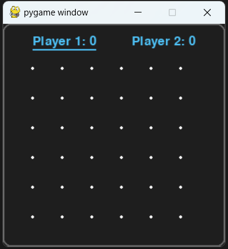

# Dot and Boxes Game

Welcome to Dot and Boxes , it  is a classic pen-and-paper game where two players take turns connecting dots to form lines. When a player completes a box by forming the fourth side, they score a point and get another turn. The player with the most boxes at the end of the game wins.

## Background Blocks 
 The game is built using Pygame:
 Pygame is a set of Python modules designed for writing video games. Pygame adds functionality on top of the excellent SDL library. This allows you to create fully featured games and multimedia programs in the python language.
 Pygame is highly portable and runs on nearly every platform and operating system.
 Pygame itself has been downloaded millions of times.
 Pygame is free. Released under the LGPL licence, you can create open source, freeware, shareware, and commercial games with it. See the licence for full details.
 For a nice introduction to pygame, examine the line-by-line chimp tutorial, and the introduction for python programmers. buffer, and many other different backends... including an ASCII art backend! OpenGL is often broken on linux systems, and also on windows systems - which is why professional games use multiple backends.
 Multi core CPUs can be used easily. With dual core CPUs common, and 8 core CPUs cheaply available on desktop systems, making use of multi core CPUs allows you to do more in your game. Selected pygame functions release the dreaded python GIL, which is something you can do from C code.
 Uses optimized C and Assembly code for core functions. C code is often 10-20 times faster than python code, and assembly code can easily be 100x or more times faster than python code.

## Features

- **Grid-based Gameplay**: The game consists of a grid where players take turns to draw lines between dots.
- **Two Players**: The game supports two players, either two human players taking turns.
- **Turn-based System**: The game alternates turns between the players unless a player completes a box, in     which case they get an extra turn.
- **Score Tracking**: Keep track of each player's score throughout the game.

## Instructions for Playing

1. **Player Representation**: Player 1 is represented by 'X' and Player 2 is represented by 'O'.
2. **Drawing Lines**:
   - Use the arrow keys to draw lines:
     - Up Arrow: Draw the top line of the selected cell.
     - Right Arrow: Draw the right line of the selected cell.
     - Down Arrow: Draw the bottom line of the selected cell.
     - Left Arrow: Draw the left line of the selected cell.
   - Alternatively, you can also use the mouse to select cells by clicking on them.
3. **Scoring**: When a player completes the fourth side of a box, they earn a point and get an additional turn.
4. **Game Over**: The game ends when all the boxes are completed. A "Game Over" message will be displayed.
5. **Restart and Quit**: Press the 'R' key to restart the game at any time. Press 'Q' or the 'Escape' key to quit the game.

## Additional Enhancements that can done/progress

- **Sound Effects**: Introduce sound effects for actions like placing a line, winning, or game over to enhance the user experience.
- **Animations**: Add animations for line drawing or winning sequences to make the gameplay more engaging.
- **Customization Options**: Allow players to customize their experience by choosing colors, symbols, or grid sizes.
- **AI Opponent**: Implement an AI opponent for single-player mode using algorithms like Minimax or Monte Carlo Tree Search.
- **Network Multiplayer**: Add network multiplayer functionality so players can compete against each other online.
- **Menu System**: Create a menu system for starting the game, adjusting settings, and quitting.
- **Error Handling**: Implement error handling to gracefully handle unexpected user inputs or edge cases.

 ## Getting  Started
 To run the game, kindly follow the steps given in [Readme.md](https://github.com/shrawani21/gamer_21/blob/main/README.md) & enjoy the Dots & Boxes Game by Pygame .

 
 ## Contibuting Guidelines 
  We believe in the power of collaboration. If you have ideas to improve College.ai, feel free to contribute! Check out our [Contribution Guidelines]https://github.com/shrawani21/gamer_21/blob/main/Contributing.md   to get started.

 # Message From PA

 Welcome to Dots & Boxes!!

We're glad you're here and excited for you to explore our project. Whether you're checking out the code, contributing to the project, or providing feedback, your presence and input are invaluable.

Feel free to dive in, get involved, and make gamer_21 even better!
🌟 **Enjoy exploring the world of games!**

Happy coding!